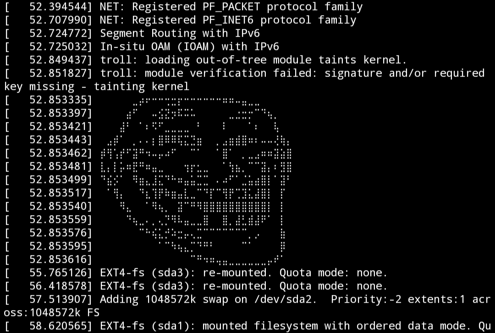

# What's this?
It's just a funny little Linux kernel module that shows trollface when being loaded, nothing more and nothing less.
### But why?
It's funny, Ha! get it? cuz trollface = funny..  
ok nevermind 

  

# I am interested, how to install?
Just clone this repo, cd to the directory and:  

`make`  

`insmod troll.ko`

or

`make install`  

`depmod -a`

If you want to install it on your system.

(type `dmesg` to see the trollface)

# You suck!
I know.